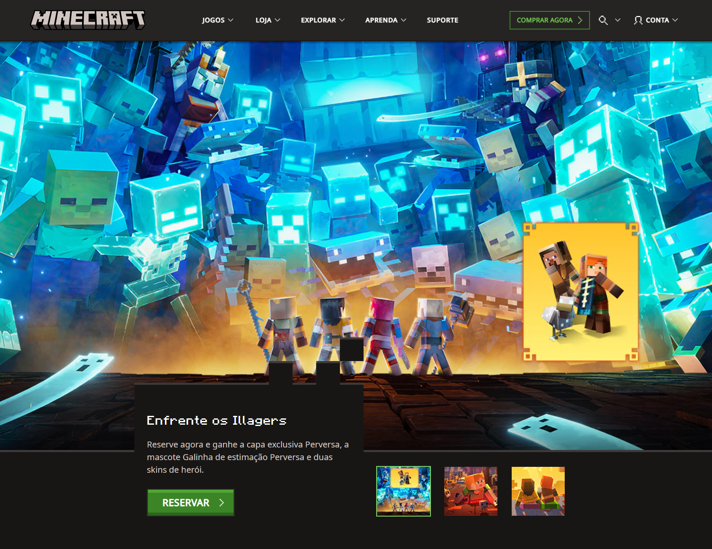
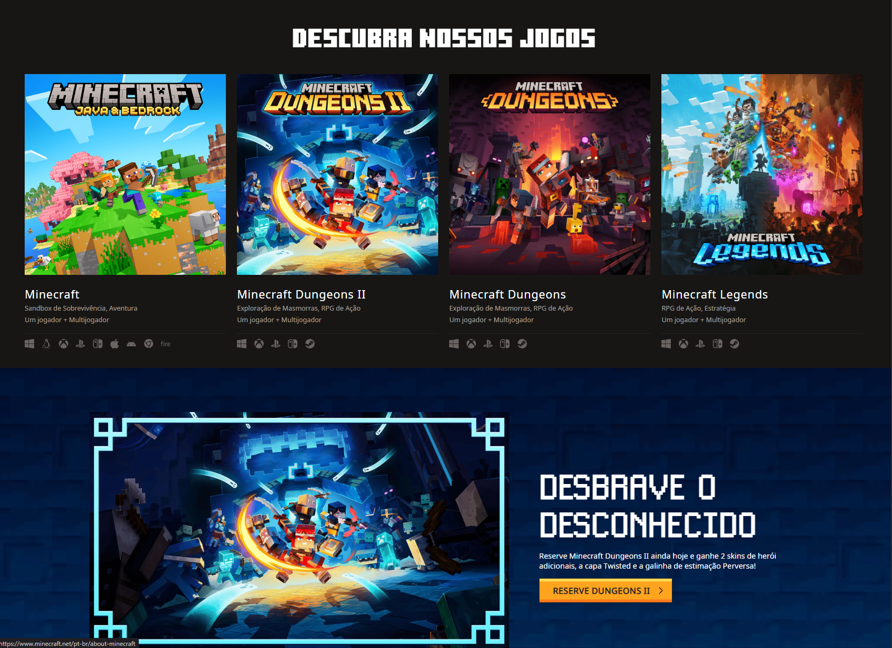
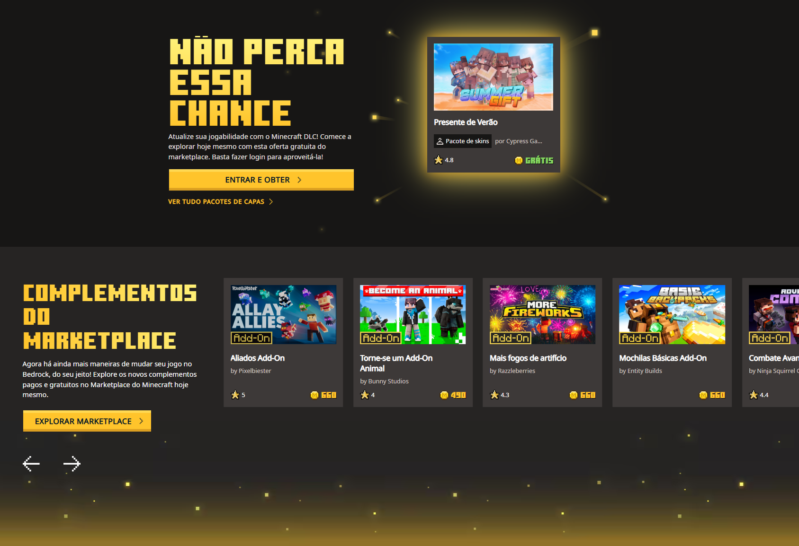
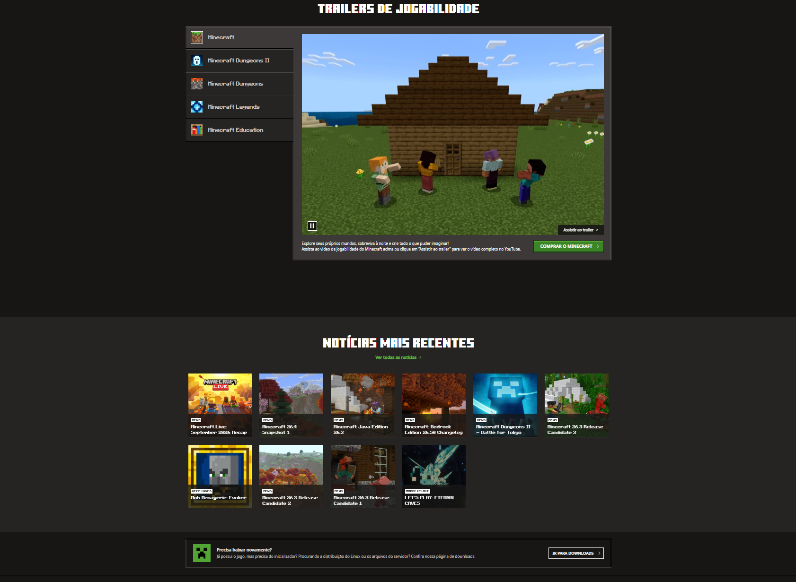
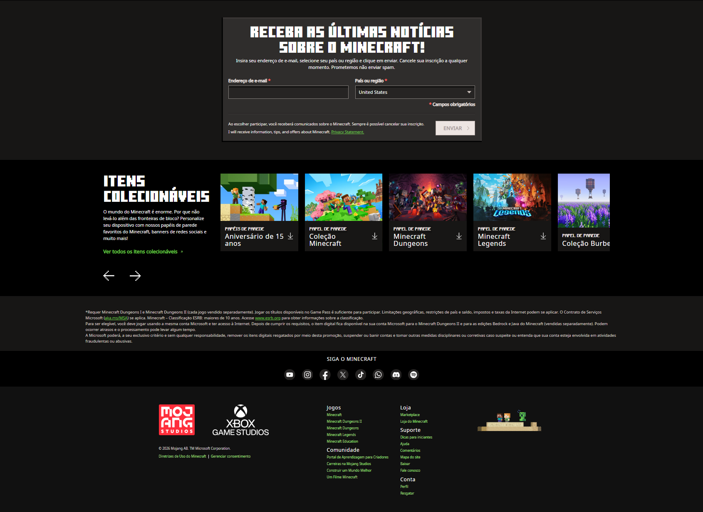
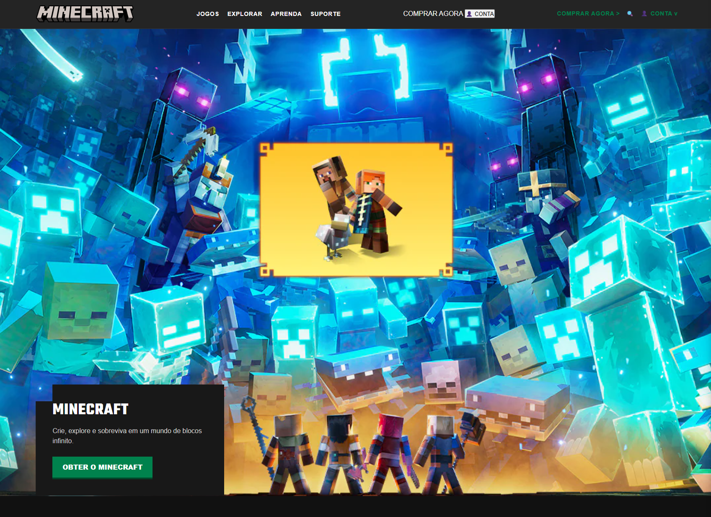
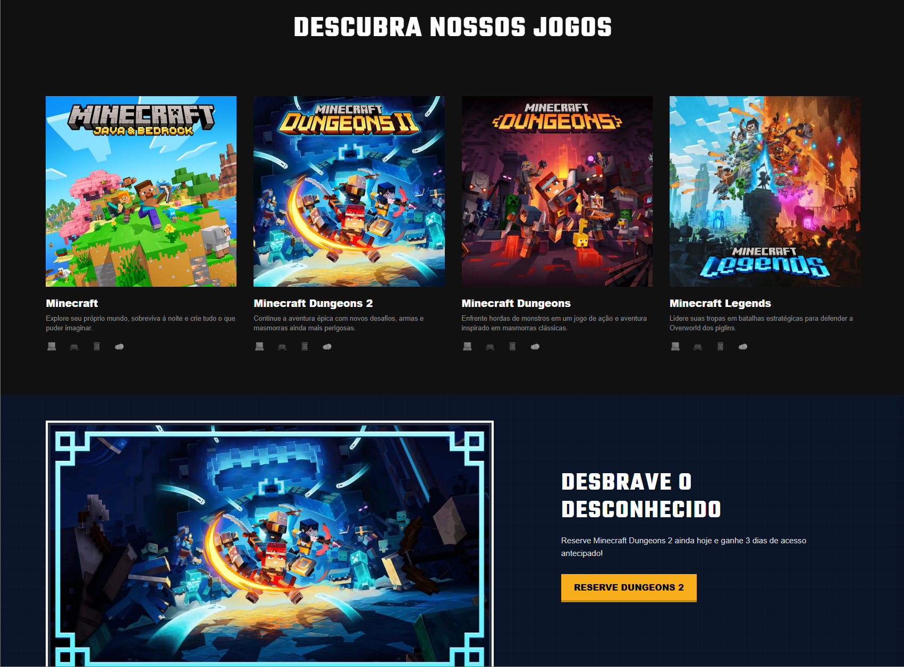
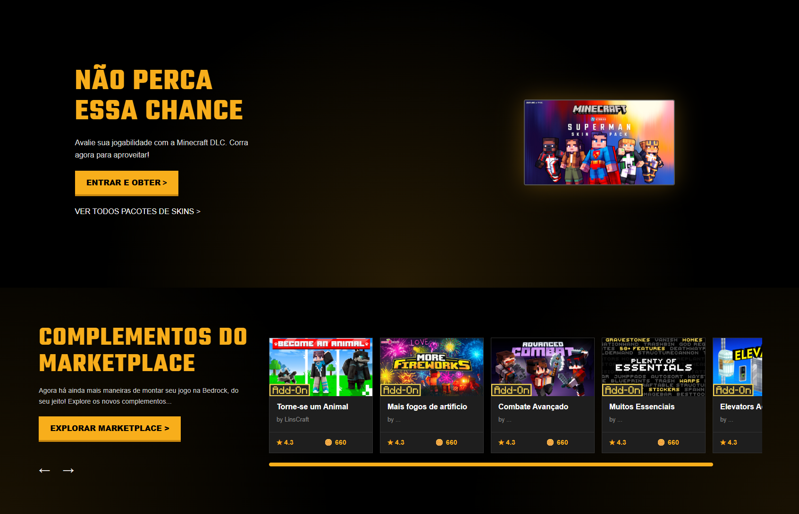
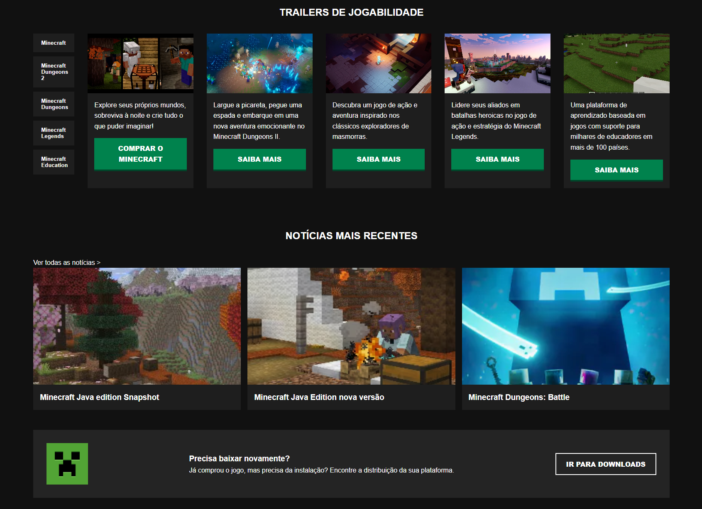
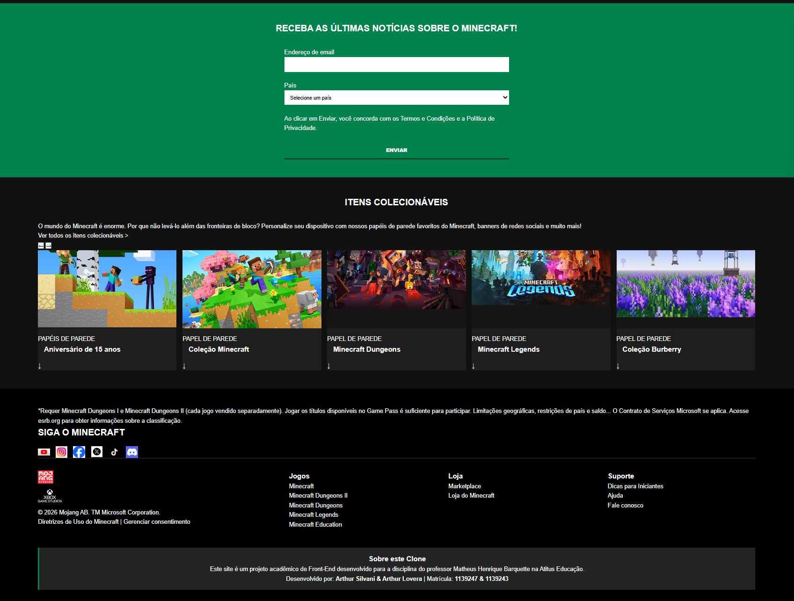

Clone do Site Oficial do Minecraft

Este projeto é um clone da página inicial do site oficial do Minecraft, desenvolvido como requisito para a avaliação de G1 da disciplina de Front-End, lecionada pelo professor Matheus Henrique Barquette na Atitus Educação.

Desenvolvedores:

Arthur Silvani (Matrícula: 1139247)

Arthur Lovera (Matrícula: 1139243)

Site de Referência: Site Oficial do Minecraft

📸 Comparação Visual

Desktop

Original:

   
   
   
   
   

Nosso Clone:

   

   
   
   

Checklist e Explicações do Desenvolvimento 

*1.1 Estrutura HTML Semântica e Acessível*

O projeto foi inteiramente estruturado utilizando tags HTML5 semânticas, evitando o uso excessivo de "div".

Semântica: Utilizamos "header" para o topo, "nav" para os menus de navegação, "main" para o conteúdo principal, "section" para os grandes blocos de conteúdo (como jogos, notícias e colecionáveis), "article" para os cards individuais de jogos e complementos, e "footer" para o rodapé.

Acessibilidade: Todas as imagens possuem o atributo alt descritivo. Os formulários de pesquisa e de newsletter possuem "label" associados aos "input". No caso do formulário de busca, a label possui a classe .sr-only para ficar oculta visualmente, mas acessível para leitores de tela.

*1.2 Fidelidade Visual à Referência*

Buscamos manter as proporções, o esquema de cores escuro, os espaçamentos e a tipografia o mais próximo possível do original.

Tipografia: Utilizamos as fontes do Google Fonts Teko (para títulos grandes e de impacto, imitando a fonte do jogo) e Noto Sans (para textos corridos).

Cores: Mapeamos os tons exatos de verde, cinza e preto do site original utilizando variáveis de CSS para manter a consistência.

Análise da Página Original: Observando o site oficial da Microsoft/Minecraft, notamos que ele segue uma estrutura bem modular de "faixas" horizontais (sections), o que nos permitiu dividir o HTML de forma lógica. A página original também abusa do contraste entre fundos escuros e botões de ação (Call to Action) verdes ou laranjas, padrão que replicamos com fidelidade.

*1.3 CSS: Seletores, Box Model e Variáveis*

O CSS foi estruturado de forma moderna e organizada.

Variáveis: Utilizamos o seletor :root para definir a paleta de cores (--cor-fundo, --cor-verde-primaria, etc.) e o sistema de espaçamentos (--espacamento-padrao, --espacamento-xl), garantindo fácil manutenção.

Box Model: Resetamos margin e padding com * { box-sizing: border-box; } e usamos espaçamentos consistentes (padding/gap) baseados nas variáveis criadas.

Seletores: Cumprimos o requisito de variedade de seletores:

Seletor de Classe: .btn-primary (para estilizar os botões principais).

Seletor Descendente: .header-principal nav a (seleciona os links apenas dentro da navegação do cabeçalho).

Seletor de Pseudo-classe: .btn-primary:hover e .game-card:hover (para as animações de interação ao passar o mouse).

*1.4 Responsividade: Flexbox, Grid e Mobile First*

A folha de estilos foi construída seguindo o conceito de Mobile First.

Mobile First: Todo o código CSS padrão (sem media queries) foi feito pensando em telas pequenas (celulares), onde os elementos assumem blocos de 1 coluna (ex: .games-section com grid-template-columns: repeat(1, 1fr)).

Flexbox e Grid: Usamos amplamente ambos. O CSS Grid foi ideal para organizar a grade de jogos, notícias e complementos do marketplace. O Flexbox foi utilizado no alinhamento de itens internos, como no "header" e na dungeons-promo.

Media Queries: Utilizamos @media (min-width: 768px) e @media (min-width: 1024px) apenas para expandir o layout em telas maiores (tablets e desktops), transformando colunas únicas em grades de 2 a 5 colunas.

*1.5 Personalização e Originalidade*

Para cumprir o requisito de um trecho que não existe no site original, adicionamos uma seção customizada no final do site, dentro do "footer":

Sobre este Clone (.custom-clone-info): Criamos um bloco destacado com borda verde lateral que informa os dados acadêmicos do projeto, o nome do professor, a instituição (Atitus) e os dados da nossa dupla (nomes e matrículas).

*--- Como executar o projeto ---*

Faça o download ou clone este repositório.

Abra a pasta do projeto.

Dê um duplo clique no arquivo index.html para abri-lo no seu navegador padrão.
(Nenhuma instalação adicional ou servidor local é necessário).